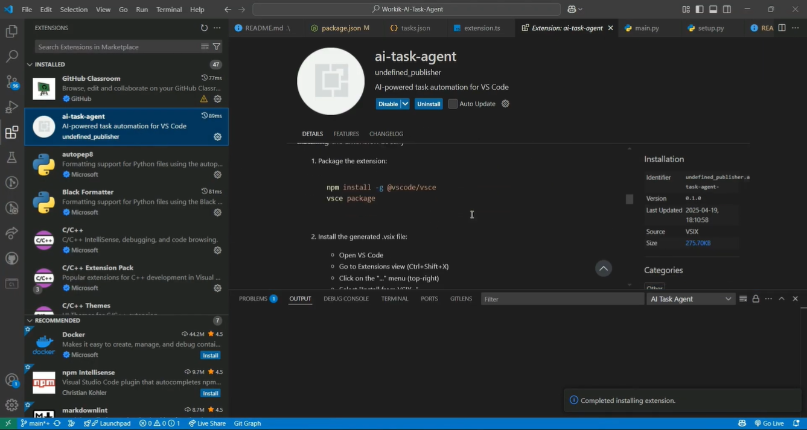

# AI Task Agent

An AI-powered command line tool that helps you execute tasks on your local machine with AI assistance.

## Features

- Process natural language task descriptions
- Generate execution plans using AI
- Execute commands safely on your local machine
- Interactive feedback loop to refine tasks if needed

## 📽️ Demo Video

[](https://drive.google.com/file/d/1OjmfcM7dt4UvEsorbhlOEvA-rdGR0o0Z/view?usp=sharing)

> **Click the image above** to watch a full walkthrough of the AI Task Agent in action, showcasing the full project flow, usage examples, and the VSCode extension.

## Installation

### Prerequisites

- Python 3.7+
- Groq API key or HuggingFace Inference API key

### Setup

1. Clone the repository:
   ```bash
   git clone https://github.com/1shChheda/AI-Task-Agent-Project.git
   cd AI-Task-Agent-Project
   ```

2. Create a virtual environment and activate it:
   ```bash
   python -m venv .venv
   
   # On Windows
   .\.venv\Scripts\activate
   
   # On macOS/Linux
   source .venv/bin/activate
   ```

3. Install the package in development mode:
   ```bash
   pip install -e .
   ```

4. Copy `.env.template` to `.env` and add your API keys:
   ```bash
   cp .env.template .env
   ```
   
   Then edit the `.env` file with your API keys:
   ```
   GROQ_API_KEY=your_api_key_here
   HUGGINGFACE_API_TOKEN=your_api_key_here
   ```

## Usage

The tool can be used in two ways:

### Interactive Mode

Run the tool without arguments to enter interactive mode:

```bash
ai-task
```

### Direct Mode

Provide a task directly:

```bash
ai-task run --task "Create a simple calculator program in Python"
```

### Debug Mode

Enable debug mode for more verbose output:

```bash
ai-task run --debug --task "Find all .txt files in the current directory"
```

## Examples

Here are some example tasks you can try:

- "Generate a React component for a contact form"
- "Find and list all .txt files in the current directory"
- "Create a simple calculator program in Python"

## Project Structure

```
/AI-Task-Agent-Project
├── ai_integration/          #AI API clients (Groq, HuggingFace) and response parsing
├── cli/                     #CLI logic and entrypoint
├── executor/                #Local command execution and file creation
├── feedback/                #User feedback and refinement handling
├── vscode-extension/        #VS Code extension source and resources
├── media/                   #Media assets (e.g., demo thumbnails)
├── requirements.txt         #Python dependencies
├── setup.py                 #Package setup
└── .env.template            #Sample environment config
```